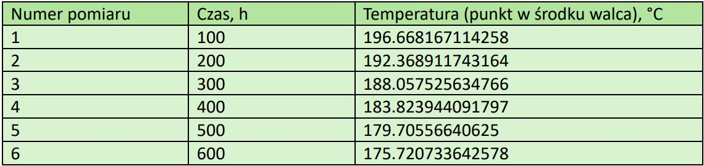

# Parametric Simulation of Cuboid Cooling

## About project
The aim of the project was to create a function to **simulate the cooling of a cuboid**, taking into account **heat transfer** by **convection** and **radiation**, 
which allows the modelling of thermal processes in objects of specific dimensions.

Another purpose was to use **inverse analysis** and the **Levenberg-Marquardt algorithm** to determine the **heat transfer coefficient 𝛼**, which allows thermal 
parameters to be identified from experimental or simulation data.

## Technologies
The project was done using **Python** for data processing and optimization, along with **Abaqus** for numerical simulations of the cooling process.

## Project implementation process
Creating a model:

Result of the first temperature distribution obtained:

Designated **heat transfer coefficient**: **1.0**
Value of **target function** after optimisation: **60470.3342206**
Number of **iterations** carried out: **6**
Results of **temperature distribution** after **cooling process** [(measurement number, number of iterations carried out, temperature (point at centre of cylinder)]:

**Graphs** showing the **temperature dependence of the number of operations performed**:

The temperature at the **central point of the cylinder** shows a **decreasing trend over time**. This is **consistent** with expectations for the **cooling process**.
